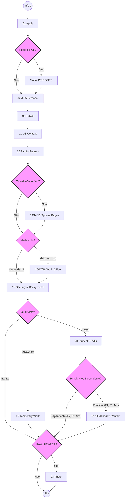

# Matriz Global de Navegação (Routing Guidelines)

Este documento especifica o macro-comportamento roteador do formulário. Ele rege **quais páginas inteiras irão aparecer ou desaparecer** na jornada do aplicante ou do motor dinâmico baseado em uma combinação de variáveis primárias (Demografia, Localidade e Categoria Consular). 

> [!TIP] Escopo de Cobertura e Flexibilidade de Vistos
> A arquitetura e a modulação adotadas nesta Spec foram pensadas para **nativamente permitir qualquer visto Não-Imigrante** (todos os que exigem o DS-160).
> Não há trava tecnológica a 1 ou 2 tipos. No entanto, por questões de foco comercial e de fluxo, a validação de arquitetura **prioriza o mapeamento ativo das classes: B (Turismo/Negócios/Tratamentos Médicos), F, J, M (Estudos/Intercâmbios) e O.**
> *Nota: Variações ainda não intensamente mapeadas (como M) seguem o esqueleto padrão e podem exigir calibração empírica dos módulos de ramificação ao entrarem em produção.*

O fluxo normal (baseline) é concebido sempre sob a ótica do visto B (Turismo/Negócios) para maiores de idade.Qualquer implementação do motor (Filler) ou construção de front-end dinâmico no portal do usuário deve considerar como mandatórias as seguintes ramificações (Bypass/Skip rules):

## 1. Fluxograma de Decisão Global (State Machine)

## 2. Gatilhos Demográficos
- **Isenção Sub-14 (Work/Education Skip):**
  Se a "Data de Nascimento" calcular que a idade atual do aplicante é rigorosamente **menor que 14 anos**, as 3 páginas da seção inteira de *Work/Education/Training* (Current, Previous, e Additional) serão suprimidas da rodada do CEAC. A navegação salta de Family/Relatives direto para *Security and Background*.
- **Expansão de Relacionamento (Estado Civil):**
  Se a resposta em "Marital Status" for configurada como `Casado`, `Viúvo`, `Separado` ou `Divorciado`, o roteiro adicionará forçosamente, após a seção Parents, a respectiva página extra familiar que colherá as informações do parceiro atrelado (Info Cônjuge Atual, Cônjuge Anterior ou Cônjuge Falecido). Solteiros não ativam essa rota.

## 3. Gatilhos de Localidade Congestionada (Consulado)
Políticas específicas regionais disparam alterações na primeira (Apply) ou última (Photo) tela. Dependendo do posto consular escolhido (Location), teremos modificadores de fluxo isolados:
- **Exigência Digital de Foto (PTA / RCF):**
  Se a região selecionada no passo principal (01_Apply) for Porto Alegre (PTA) ou Recife (RCF), a página final de "Upload Photo" tornar-se-á **obrigatória** na via antes do *Review*, bloqueando quem não preparou mídia digital antecipadamente.
- **Intercepção de Modal Pré-Captcha (Exclusivo RCF):**
  Ao selecionar a localidade Recife, o gateway inicial ASP.NET empurrará um *Modal* HTML imediato contendo anúncios do posto. O robô (ou a UI) é forçado a interagir despachando um "fechar" na UI explícito antes que a caixa de Captcha esteja em um estado renderizável/focado habilitando a sequência.

## 4. Gatilhos de Categoria de Visto (Visa Classes)
A categoria de visto dita o esqueleto final da aplicação:
- **Baseline (Visão Padrão B1/B2):**
  O esqueleto macro que percorre Personal -> Travel -> US Contact -> Family -> Work -> Security é a "Base B". Todos os vistos iniciam consumindo inteiramente a Base B.
- **Ramificações Condicionais Específicas (Vistos O, F, J e Ramificações Dependentes):**
  A engine nunca deve agregar módulos baseando-se em listas injetadas no fim da esteira. Regras estritas de ramificação ocorrem ao final da sessão Security:
  - **Vistos Temporários de Trabalho (O1, O2):** Ganham a ramificação exclusiva *Temporary Work*.
  - **Vistos de Estudante e Intercâmbio (F, M, J):** Todas as classes F, M e J ativam de pronto a tela *Student/Exchange SEVIS*. 
  - **Filtro Estrito Principal vs. Dependente (Student Add Contact):** *Somente* os requerentes Principais (Ex: F1, J1, M1) acessarão a rota *Student Add Contact* (onde preenchem 2 pontos de contato da Universidade/Sponsor). Se a automação notar tratar-se de um portador *Dependente Familiar* acompanhante (Ex: F2, J2, M2), ela deverá obrigatoriamente ocultar esse nó e dar Skip/Bypass, saltando direto para Photo Upload. Dependentes nunca declaram contato escolar americano.
